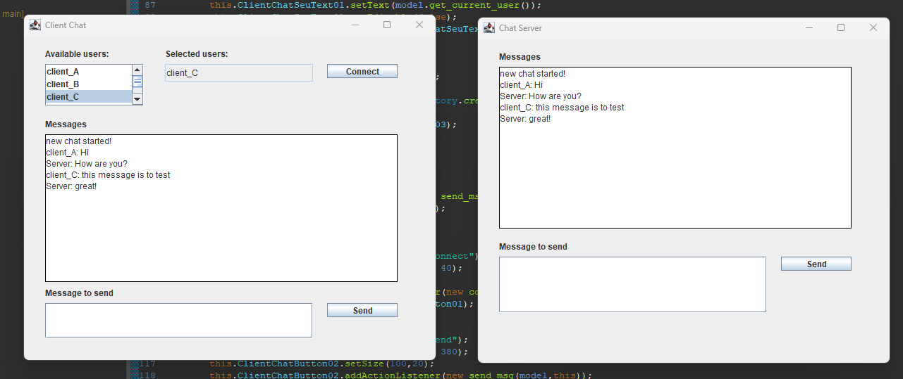
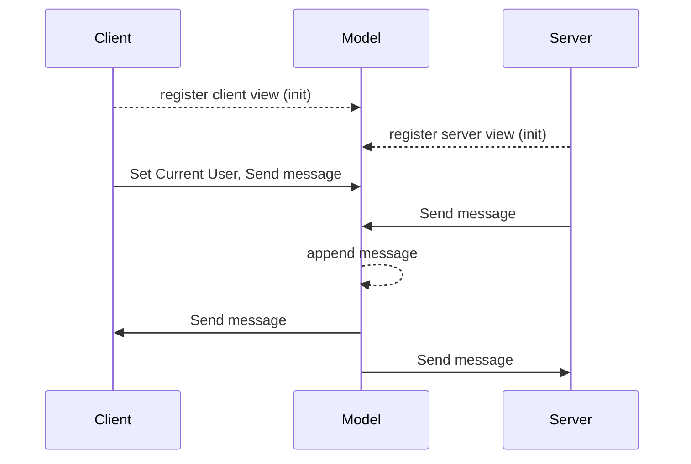

# Client and Server Chat application in JAVA implementation

## Introduction

 Simple chat application with multiple clients and single server view. Client can select their ID from the JList section. Upon the selection, the name on chat log will be differed. Client and server messages will be transferred to each other's message view. This implementation did not utilized socket. Instead, it used common model shared over client and server. 

## App Overview
 
  

## Sequence Diagram

## Used Environment
- Windows 11
- JAVA : 1.8.0_351
- JRE : 17.0.4
